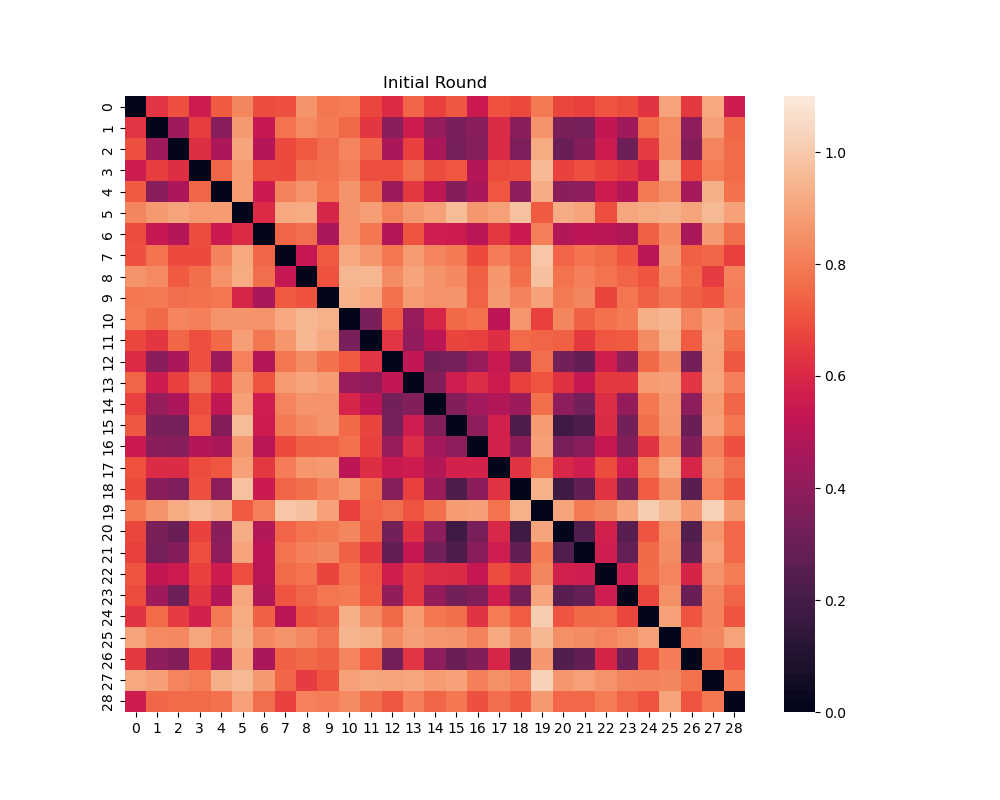
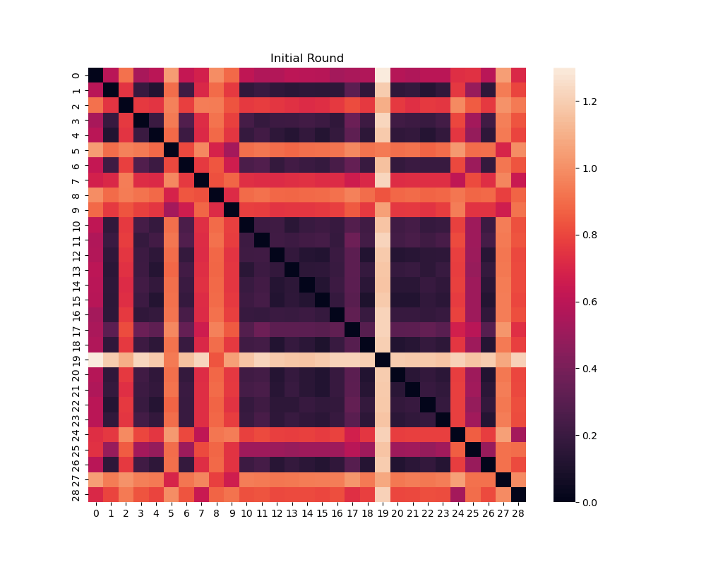

# Data-driven optimization of biomarker panels in highly multiplexed imaging
Here shows the implementation of our algorithm for choosing a minimal predictive subset of markers that allows the 
prediction of a set of markers in full images.  

## Usage
Generally, at first, we partition the whole set of markers into the input and output subsets, and fit input and output sets
into a predictive model, then make prediction of markers in the output set from the markers in the input set. We select 
the markers into the input set iteratively using a fully connected graph with nodes representing the markers we are interested in.

### Basic version experiment
1. Initialize edge weights of graph
```python
python initialization/corr.py
```
Say the number of markers in the whole set is n, then we can get an n x n matrix, including initial edge weights between 
each pair of nodes(markers).

2. Select the first input marker into input set using "input_selection/basic/train_selection_MAE.py".

See demos of rounds of selection shown in "input_selection/basic/SP29_inputSelection.ipynb" and 
"input_selection/basic/LN29_inputSelection.ipynb". These 2 jupyter notebook files show the input selection processes on spleen
and lymph node dataset, respectively.

In the Line1 of Cell2 of each file, we load the matrix of initial edge weights generated from step1 and then construct the graph. 
Cell3 chooses the first input marker.

3. Train a predictive model with current input and output set.
```python
python predictive_model/train_model_MAE_2.py --path_run_dir 'test_model'   --path_dataset_csv "train_path.csv"  --path_dataset_val_csv "val_path.csv"  --input_index 21  --target_index 0 1 2 3 4 5 6 7 8 9 10 11 12 13 14 15 16 17 18 19 20 21 22 23 24 25 26 27 28   --in_dim 1 --out_dim 28
```
--path_run_dir: base directory for saved models\
--path_dataset_csv: path to csv for constructing dataset (training set)\
--path_dataset_val_csv: path to csv for constructing validation Dataset (evaluated everytime the model is saved)\
--input_index: input channel index\
--target_index: output channel index\
--in_dim: the number of input dimension of the model\
--out_dim: the number of output dimension of the model

4. Select the second input marker into input set.\
After training the predictive model once in step3, we will get the model prediction performance in the validation set 
and update the new activated edges' weights. Edges are activated once they connect to input nodes(markers). Then we select the 
second input marker (see demo in the Cell4 of "input_selection/basic/SP29_inputSelection.ipynb" and 
"input_selection/basic/LN29_inputSelection.ipynb").

5. Train the predictive model using the pre-trained model from last round.
```python
python predictive_model/train_model_MAE_2.py --path_run_dir 'test_model2'  --path_pretrain_dir 'test_model' --checkpoint_best_model 800 --path_dataset_csv "train_path.csv"  --path_dataset_val_csv "val_path.csv"  --out_drop_index 24 --input_index 21 25 --target_index 0 1 2 3 4 5 6 7 8 9 10 11 12 13 14 15 16 17 18 19 20 22 23 24 26 27 28   --in_dim 2 --out_dim 27
```
--path_pretrain_dir: base directory for pretrained models\
--checkpoint_best_model: checkpoint of pretrained model\
--out_drop_index: index of new added input marker in the previous output subset (for removing the parameters of the new 
added input in the pretrained model)

6. Repeat step 4 and step 5 for selecting rest of input markers till stop criterion.
7. Get the final input and output subsets of markers and fit them the predictive model(same as step 5) and then test 
the prediction performance.

Below is the animation of edge weight change in the input selection process in the lymph node dataset (top) and spleen 
dataset (bottom), respectively. The numbers in the axis represent the marker index.

<p align="center">
    
    
</p>

### Distributed version experiment (2 panel version)
1. Initialization\
First, randomly choose a subset of markers (panel A) from the whole panel, then follow the input selection process in the 
basic version to select the markers in the mutual panel. At the same time, we also get markers in another panel (panel B).
Then, we initialize edge weights for each panel using "initialization/corr.py". Next, we merge these 2 matrices shown in 
"initialization/initialize_matrix.ipynb".
2. Start the input selection process using "input_selection/distributed/train_selection_two_panel.py". 
[Waiting jupyter notbook demos...] With the initialization edge weights from step1, we can select the fist input marker.
3. Train a predictive model with current input and output set similar to step 3 in basic version.
For large intestine dataset, using script "predictive_model/train_model_li.py"; for small intestine dataset, using 
script "predictive_model/train_model_si.py".
4. Select the second input marker into input set similar to step 4 in basic version.
5. Train the predictive model using the pre-trained model from last round similar to step5 in basic version.
6. Repeat step 4 and step 5 for selecting rest of input markers till stop criterion.
7. Get the final input and output subsets of markers and fit them the predictive model(same as step 5) and then test 
the prediction performance.

## Results
<p align="center">
    
</p>
Examples of patches from synthetic and real images for top and inferior 3 biomarkers for the lymph node and spleen test 
sets. The marker names below each panel show which markers are assigned to each RGB channel. The absolute difference 
between the predicted and real images are shown in the third row. The fourth row shows the expression patterns of 
markers in the selected minimal set that are most similar to the corresponding image patches shown in the second row. 
For example, for the lymph node, FoxP3 is the marker selected whose pattern is most similar to ECAD's. These illustrate 
whether accurate prediction can be made only by mimicking the input pattern or whether learning informative latent 
patterns from the input is required.
<p align="center">
    
</p>
Example images for the two panel study. Similar to the figure above, example patches from predicted and real 
images for top and inferior 3 biomarkers are shown for the large and small intestine datasets. Also shown are the 
absolute values of the differences between the prediction and real images and the marker from the selected minimal set 
which is most similar to the markers shown in the second row.

## Datasets
In the basic version experiment, we used spleen and lymph node CODEX image datasets from data published by 
[HuBMAP](https://portal.hubmapconsortium.org/search?entity_type[0]=Dataset) project. In the distributed version algorithm, 
we used HuBMAP datasets for large and small intestine image datasets. Our demo code assumes the data are split into 
training, validation and test sets and put under the paths saved in csv files e.g., "train_path.csv", "val_path.csv", 
and "test_path.csv". For basic version experiment, the training, validation and test sets of lymph node dataset can be 
found in "train_path_LN29.csv", "val_path_LN29.csv", and "test_path_LN29.csv", and those of spleen dataset can be found 
in "train_path_SP29.csv", "val_path_SP29.csv", and "test_path_SP29.csv" under "predictive_models" folder.

## Acknowlegements
fnet code is modified from [AllenCellModeling/pytorch_fnet](https://github.com/AllenCellModeling/pytorch_fnet). We thank their contribution for providing the open source software.
